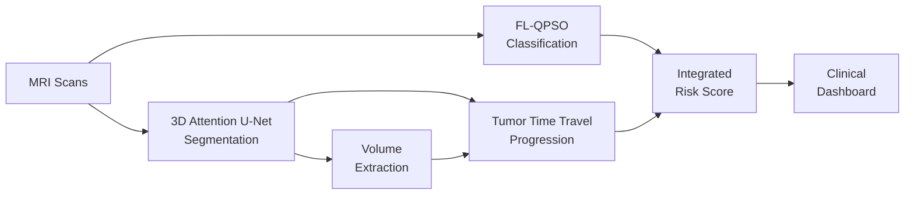

<div align="center">

# 🧠 FL-QPSO Brain Tumor Management System

**Privacy-Preserving Brain Tumor Classification, Segmentation & Progression Forecasting**

[](https://python.org)
[](https://pytorch.org)
[](https://monai.io)
[](LICENSE)
[](https://kaggle.com)

*Federated Learning with Quantum Particle Swarm Optimization for multi-institutional brain tumor analysis*

[Overview](#overview) · [Modules](#modules) · [Results](#results) · [Quick Start](#quick-start) · [Contributing](#contributing) · [Citation](#citation)

</div>

---

## Overview

**Achieving Clinical Equity in Federated Learning.** Standard Federated Averaging (FedAvg) produces high global accuracy that actively conceals severe per-institution performance disparities — leaving smaller hospitals with sub-par diagnostic models. To solve this problem, we introduce **FedQPSO**, a layer-by-layer Quantum Particle Swarm Optimization aggregation algorithm. By evaluating candidate weight configurations against a combined cross-client validation loss, FedQPSO creates an **implicit fairness constraint** without explicit fairness regularizers.

**The Finding:** Under natural heterogeneity, FedQPSO reduces the max-min accuracy gap between hospitals by **81%** compared to FedAvg. Under moderate label skew, it is the *only* method that maintains clinically useful accuracy (≥80%) at the weakest client, while achieving the highest Glioma recall.

> 📄 **IEEE Paper:** *FedQPSO: Layer-by-Layer Quantum Particle Swarm Optimization for Equitable Federated Brain Tumor Classification Under Non-IID Data* (To appear)

This project presents a comprehensive **end-to-end brain tumor management pipeline** combining these advances with 3D segmentation and longitudinal progression forecasting, all trained on Kaggle Tesla P100 hardware:



| Module | What It Does | Key Result |
|--------|-------------|------------|
| **Segmentation** | 3D volumetric tumor parsing (WT/TC/ET) | Dice Score: **0.76** |
| **Classification** | Privacy-preserving tumor typing via FL | Accuracy: **99.29%** |
| **Progression** | 6-month growth prediction + RANO alerts | LSTM + Math models |

> **Prior Work:** Extends our published research *"Enhancing Federated Learning with Quantum-Inspired PSO: An IID MNIST Study"* (Edla, 2025) to the harder Non-IID medical imaging setting.

---

## Modules

### Module 1: 3D Attention U-Net Segmentation

Volumetric segmentation of brain tumors from multimodal MRI (BraTS 2021) using MONAI.

- **Input:** 4 MRI modalities (T1, T1ce, T2, FLAIR) — 3D volumes
- **Output:** Tumor masks (Whole Tumor, Tumor Core, Enhancing Tumor)
- **Architecture:** 3D Attention U-Net with attention gates
- **Results:** Mean Dice **0.76** | TC Dice **0.85** | ET Dice **0.79**
- **Demo:** Interactive Streamlit app for 3D slice visualization

📂 [`segmentation/`](segmentation/) · 📄 [Module README](segmentation/README.md)

---

### Module 2: Federated Classification with QPSO

Privacy-preserving brain tumor classification across 3 simulated hospital nodes.

- **Model:** ResNet-18 (ImageNet pretrained, 11.17M params)
- **Classes:** Glioma, Meningioma, Pituitary
- **Aggregation:** FedAvg vs FedProx vs **QPSO-FL**
- **3 Experimental Setups:** Natural heterogeneity ✅ | Label skew | Extreme skew

```
QPSO Update Rule:
  p = φ · mean(pbests) + (1-φ) · gbest          # attraction point
  x' = p ± β · |mbest - x| · ln(1/u)            # quantum position update
```

📂 [`federated_learning/`](federated_learning/) · 📄 [Module README](federated_learning/README.md)

---

### Module 3: Tumor Time Travel (Progression)

Longitudinal growth prediction using mathematical models and LSTM deep learning.

- **Mathematical Models:** Exponential, Gompertz, Logistic, Linear
- **Deep Learning:** LSTM time-series forecaster
- **Output:** 6-month growth curves, RANO status (CR/PR/SD/PD), risk alerts
- **Datasets:** MU-Glioma-Post, LUMIERE, UCSD-PTGBM (from TCIA)

📂 [`progression/`](progression/) · 📄 [Module README](progression/README.md)

---

## Results

### Classification — Setup 1 (Natural Heterogeneity)

| Metric | FedAvg | FedProx | **FedQPSO (Ours)** |
|--------|--------|---------|----------------|
| **Best Accuracy** | 95.80% | **96.13%** | 95.14% |
| **Client Fairness (σ)** | 5.28% | 2.27% | **1.56%** |
| **Max-Min Gap (pp)** | 12.20 | 5.30 | **2.32** |
| **Compute Overhead / Round** | **7.84s** | 8.03s | 75.09s |

### Classification — Setup 2 (Label Skew 70/10/10/10)

| Metric | FedAvg | FedProx | **FedQPSO (Ours)** |
|--------|--------|---------|----------------|
| **Best Accuracy** | 90.56% | **93.02%** | 92.09% |
| **Weakest Hospital Acc** | 60.42% | 77.50% | **80.00%** |
| **Client Fairness (σ)** | 12.82% | 6.05% | **3.65%** |
| **Glioma Recall** | 0.8371 | 0.8620 | **0.8914** |
| **Compute Overhead / Round** | **8.03s** | 8.16s | 74.92s |

> *Hardware Note: Models were accelerated using a Tesla P100 GPU on the Kaggle platform.*

### Segmentation — BraTS 2021

| Region | Dice Score |
|--------|-----------|
| Tumor Core (TC) | **0.85** |
| Enhancing Tumor (ET) | 0.79 |
| Whole Tumor (WT) | 0.65 |
| **Mean** | **0.76** |

---

## Quick Start

### Prerequisites

- Python 3.8+
- CUDA-compatible GPU (recommended)
- [Kaggle account](https://kaggle.com) for notebook execution

### Installation

```bash
# Clone the repository
git clone https://github.com/DIVYANSH-TEJA-09/BrainTumor-FL-Pipeline.git
cd FL_QPSO_FedAvg

# Create virtual environment
python -m venv venv
source venv/bin/activate      # Linux/Mac
# venv\Scripts\activate       # Windows

# Install dependencies
pip install -r requirements.txt
```

### Running the Modules

#### Segmentation (Local)
```bash
cd segmentation/streamlit_app
streamlit run app.py
```

#### Federated Learning (Kaggle)
Upload notebooks from `federated_learning/notebooks/` to Kaggle:

| Notebook | Purpose | Runtime |
|----------|---------|---------|
| `notebook1_data_prep.ipynb` | Prepare client datasets | ~30 min |
| `notebook2_training.ipynb` | Train FedAvg/FedProx/QPSO | ~7-8 hrs |
| `notebook3_evaluation.ipynb` | Analyze results & plots | ~15 min |

---

## Repository Structure

```
FL_QPSO_FedAvg/
│
├── segmentation/              # Module 1: 3D Attention U-Net
│   ├── dataset_step1_refined.ipynb
│   ├── streamlit_app/         # Interactive demo app
│   ├── extract_demo_data.py
│   └── inspect_data.py
│
├── segmentation_2d/           # 2D BraTS segmentation experiments
│   ├── BinarySeg.ipynb
│   └── MulticlassSeg.ipynb
│
├── federated_learning/        # Module 2: FL-QPSO Classification
│   ├── src/                   # Core implementation
│   │   ├── model.py           # ResNet-18 classifier
│   │   ├── client.py          # Federated client
│   │   ├── server_fedavg.py   # FedAvg aggregation
│   │   ├── server_qpso.py     # QPSO aggregation
│   │   ├── trainer_fedavg.py  # FedAvg training loop
│   │   ├── trainer_qpso.py    # QPSO training loop
│   │   ├── data_loader.py     # Multi-source data loading
│   │   ├── preprocessor.py    # Image preprocessing
│   │   ├── dataset.py         # PyTorch Dataset
│   │   ├── analysis.py        # Statistical analysis
│   │   ├── visualize.py       # Plotting utilities
│   │   └── utils.py           # Helper functions
│   ├── notebooks/             # Kaggle execution notebooks
│   ├── setup1_natural/        # Setup 1: Natural heterogeneity
│   ├── setup2_label_skew/     # Setup 2: 80/10/10 skew
│   └── setup3_extreme_skew/   # Setup 3: Single-class extreme
│
├── progression/               # Module 3: Tumor Time Travel
│
├── dashboard/                 # Clinical Dashboard
│   ├── app.py                 # Streamlit application
│   ├── config.py
│   ├── models/
│   ├── static/
│   ├── templates/
│   └── utils/
│
├── paper/                     # IEEE Paper Sources
│   ├── paper.tex              # 3-method (FedAvg vs FedProx vs FedQPSO)
│   ├── paper_fedavg_vs_qpso.tex # 2-method comparison
│   └── figs/                  # Paper figures
│
├── thesis/                    # Thesis Documentation (LaTeX)
│   ├── main.tex
│   ├── references.bib
│   ├── generate_chapters.py
│   ├── chapters/
│   └── figures/
│
├── docs/                      # Documentation
│   ├── FINAL_PROJECT_PROPOSAL.md
│   ├── INTEGRATION_GUIDE.md
│   ├── TUMOR_PROGRESSION_COMPLETE_GUIDE.md
│   ├── PPT_CONTENT_AND_DIAGRAMS.md
│   ├── PROJECT_DOCUMENTS_INDEX.md
│   ├── chapters/              # Finalized markdown chapters
│   └── reference/             # Department guidelines
│
├── diagrams/                  # Architecture diagrams
│   ├── mermaid/               # Mermaid source files
│   ├── rendered/              # Exported PNGs
│   └── render_diagrams.py     # Rendering script
│
├── presentation/              # Presentation assets
│
├── .github/                   # GitHub templates
│   ├── ISSUE_TEMPLATE/
│   └── PULL_REQUEST_TEMPLATE.md
│
├── .gitignore
├── CONTRIBUTING.md
├── LICENSE
├── README.md
└── requirements.txt
```

---

## Documentation

| Document | Description |
|----------|-------------|
| [Project Proposal](docs/FINAL_PROJECT_PROPOSAL.md) | Abstract, objectives, architecture, research & patent potential |
| [Integration Guide](docs/INTEGRATION_GUIDE.md) | How to connect all modules into a unified pipeline |
| [Progression Guide](docs/TUMOR_PROGRESSION_COMPLETE_GUIDE.md) | Complete tumor growth prediction implementation |
| [PPT Content](docs/PPT_CONTENT_AND_DIAGRAMS.md) | Presentation content with Mermaid diagrams |
| [Research Paper](federated_learning/RESEARCH_PAPER.md) | Paper reference for FL-QPSO vs FedAvg |

---

## Research & Publications

### Prior Publication
> Edla, D.T. (2025). *"Enhancing Federated Learning with Quantum-Inspired Particle Swarm Optimization: An IID MNIST Study."* Matrusri Engineering College.

### Target Venues
- **IEEE Transactions on Medical Imaging**
- **MICCAI** (Medical Image Computing and Computer Assisted Intervention)
- **Medical Image Analysis (MedIA)**

### Key References
- McMahan et al., 2017 — FedAvg
- Li et al., 2020 — FedProx
- Sun et al., 2004 — QPSO Algorithm
- Bakas et al., 2018 — BraTS 2020 Dataset
- Oktay et al., 2018 — Attention U-Net
- Sheller et al., 2020 — FL for Brain Tumor Segmentation

---

## Contributing

We welcome contributions! Please see [CONTRIBUTING.md](CONTRIBUTING.md) for guidelines on:
- Branching strategy and commit conventions
- Code style (PEP 8, type hints, docstrings)
- Pull request process
- Bug reports and feature requests

---

## Citation

If you use this work, please cite:

```bibtex
@software{edla2025flqpso,
  title     = {FL-QPSO: Privacy-Preserving Brain Tumor Management System},
  author    = {Edla, Divyansh Teja},
  year      = {2025},
  institution = {Matrusri Engineering College},
  url       = {https://github.com/DIVYANSH-TEJA-09/BrainTumor-FL-Pipeline}
}
```

---

## License

This project is licensed under the MIT License — see the [LICENSE](LICENSE) file for details.

---

<div align="center">

**Built with** ❤️ **for privacy-preserving medical AI**

</div>
